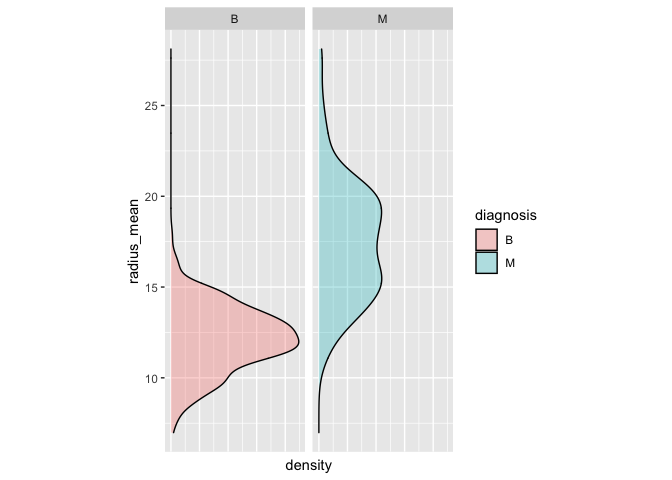
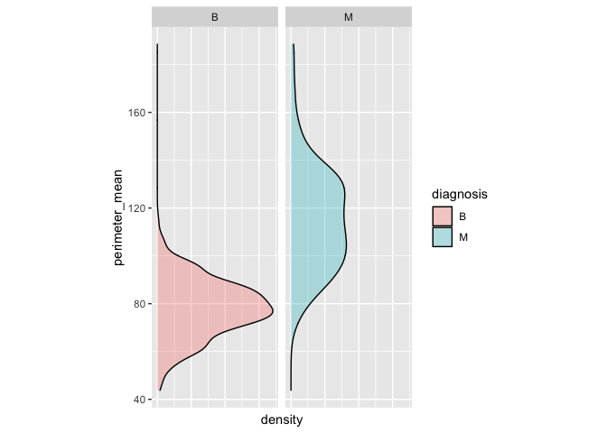

<!-- README.md is generated from README.Rmd. Please edit that file -->

# Ex1

<!-- badges: start -->

<!-- badges: end -->

The goal of Ex1 is to draw density plots for the parameters listed in
cancer\_sample data set and use different diagnosis types as facets to
separate them

## Installation

Ex1 is not yet on CRAN. But you can download it from the repository
using the following R command.

``` r
devtools::Install_Github("Janette/Ex1")
```

And the development version from [GitHub](https://github.com/) with:

``` r
# install.packages("devtools")
devtools::install_github("stat545ubc-2021/Qingyi_Lan_Package")
```

## Example

This is a basic example which shows you how to solve a common problem:

``` r
library(Ex1)
library(datateachr)
library(ggplot2)
library(dplyr)
#> 
#> Attaching package: 'dplyr'
#> The following objects are masked from 'package:stats':
#> 
#>     filter, lag
#> The following objects are masked from 'package:base':
#> 
#>     intersect, setdiff, setequal, union
## basic example code
Ex1(cancer_sample, diagnosis, radius_mean)
```



``` r
#For this example, it works because diagnosis is a character and radius_mean is a numeric variable. The density graph displaying distribution of radius mean in different diagnosis type is successfully generated
Ex1(cancer_sample, diagnosis, perimeter_mean)
```



``` r
#For this example, it works because diagnosis is character and perimeter_mean is a numeric variable.The density graph displaying distribution of perimeter mean in different diagnosis type is successfully generated
```

This package is special because it will return error if the second
object entered is not character, or the third object entered is not
numeric value

``` r
#Example 1
Ex1(cancer_sample, perimeter_mean, radius_mean)
#> Error in Ex1(cancer_sample, perimeter_mean, radius_mean): you have entered non-charater value for x. Please check the class of xnumeric
#For this example, it does not works because the x--perimeter_mean in this function is not character, but belongs to the class of numeric. 

#Example2
Ex1(cancer_sample, perimeter_mean, diagnosis)
#> Error in Ex1(cancer_sample, perimeter_mean, diagnosis): you have entered non-charater value for x. Please check the class of xnumeric
#This does not work because x---perimeter_mean is not character and y--diagnosis is not numeric. 
```

You’ll still need to render `README.Rmd` regularly, to keep `README.md`
up-to-date. `devtools::build_readme()` is handy for this. You could also
use GitHub Actions to re-render `README.Rmd` every time you push. An
example workflow can be found here:
<https://github.com/r-lib/actions/tree/master/examples>.

In that case, don’t forget to commit and push the resulting figure
files, so they display on GitHub and CRAN.
